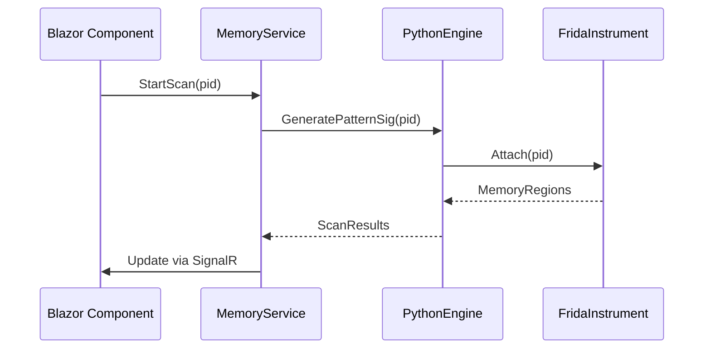

# ADR 002: Core Component Architecture

## Memory Scanning Subsystem

```csharp
public class MemoryScannerService
{
    public async Task<List<MemoryRegion>> AttachProcess(int pid)
    {
        // Uses Frida's Process.enumerateRanges()
        return await _fridaBridge.GetMemoryMap(pid);
    }

    public ScanResult PerformScan(ScanParameters parameters)
    {
        // Implements Boyer-Moore pattern matching
        return _patternMatcher.Execute(
            parameters.ProcessHandle,
            parameters.SearchPattern,
            parameters.ScanType
        );
    }
}
```

## SQLite Schema Design

```sql
CREATE TABLE ScanProfiles (
    Id INTEGER PRIMARY KEY,
    ProcessName TEXT NOT NULL,
    Offsets JSON NOT NULL, -- { "health": "0x1A4B", "ammo": "0x1C20" }
    CreatedAt DATETIME DEFAULT CURRENT_TIMESTAMP,
    Version INTEGER DEFAULT 1
);

CREATE TABLE MemoryLocks (
    Address TEXT NOT NULL,
    ValueType TEXT CHECK(ValueType IN ('int32', 'float', 'double')),
    FrozenValue BLOB NOT NULL
);
```

## Instrumentation Layer



## Security Measures

1. Memory write validation using hardware-assisted virtualization
2. Process whitelisting for critical system applications
3. Scan profile version rollback protection
4. Encrypted SQLite database using SQLCipher
