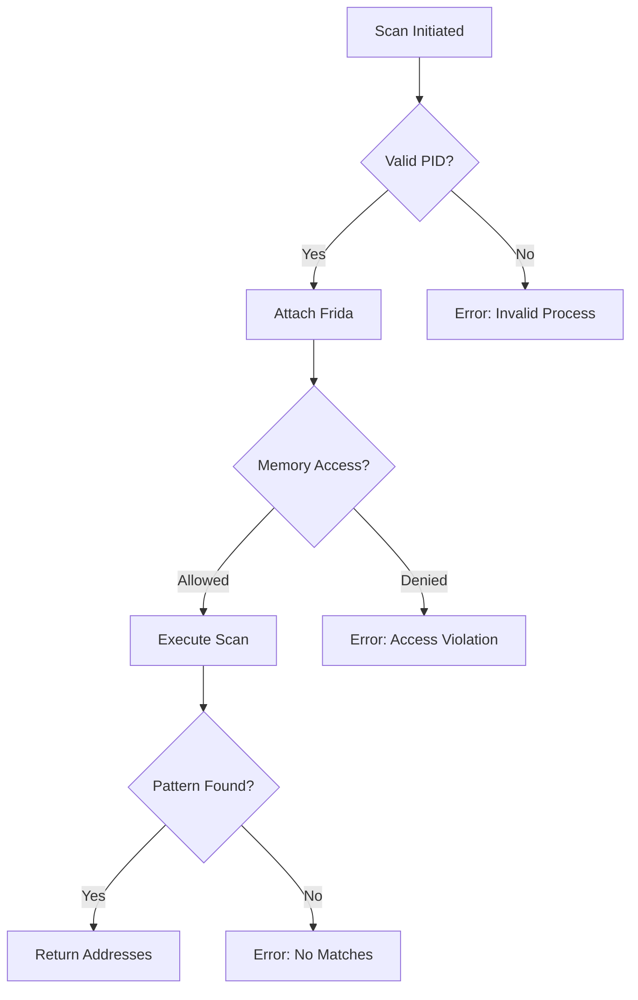

# ADR 003: Python.NET and Frida Integration Strategy

## Interprocess Communication Design

```csharp
// C# IPC Bridge
public class PythonBridgeService
{
    public async Task<ScanResult> ExecuteScan(ScanRequest request)
    {
        using var channel = GrpcChannel.ForAddress("http://localhost:50051");
        var client = new MemoryScanner.MemoryScannerClient(channel);
        return await client.ScanMemoryAsync(request);
    }
}

// Protobuf Definition
service MemoryScanner {
  rpc ScanMemory (ScanRequest) returns (ScanResult);
}

message ScanRequest {
  int32 pid = 1;
  bytes pattern = 2;
  ScanType scan_type = 3;
}
```

## Frida Instrumentation Workflow

```python
# Python Frida Controller
class FridaManager:
    def __init__(self):
        self.session = None

    def attach_process(self, pid):
        self.session = frida.attach(pid)

    def scan_memory(self, pattern):
        script = self.session.create_script("""
            Process.enumerateRangesSync('rw-').map(range => {
                return Memory.scanSync(range.base, range.size, pattern);
            });
        """)
        return script.exports.scan(pattern)
```

## Security Architecture

1. **Python Sandboxing**:

   - Restricted modules list
   - Memory operation quotas
   - System call filtering

2. **Frida Hardening**:

```javascript
{
  "runtime": "qjs",
  "interaction": {
    "allow_process_names": ["game.exe"],
    "max_scan_size": "256MB"
  }
}
```

## Error Handling Framework



## Performance Considerations

- Cached scan profiles with TTL expiration
- Parallel memory region scanning
- Binary pattern compression
- Scan interrupt/resume capability
