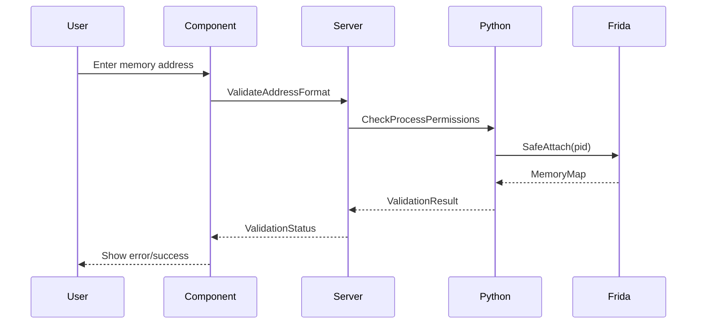

# ADR 004: UI Architecture and Security Controls

## Blazor Component Structure

```razor
<RadzenStack Orientation="Orientation.Vertical">
    <ProcessSelector @bind-Pid="_selectedPid" AllowedProcesses="_whitelist" />
    <MemoryVisualizer Data="_memoryMap" OnSelectAddress="HandleAddressSelection" />
    <AddressTable Values="_lockedValues" OnFreeze="FreezeAddress" />
    <ScanProfileManager Profiles="_profiles" OnReload="ReloadProfile" />
</RadzenStack>

@code {
    private List<MemoryAddress> _lockedValues = new();
    private ProcessWhitelist _whitelist = new();

    private async Task FreezeAddress(MemoryAddress addr)
    {
        await _memoryService.FreezeValue(
            _selectedPid,
            addr,
            new FreezePolicy {
                MaxDuration = TimeSpan.FromMinutes(5),
                ValidationMode = FreezeValidation.HardwareAssisted
            }
        );
    }
}
```

## Security Framework



## Input Validation Layers

1. **Frontend Validation**:

```razor
<RadzenDropDown Data="@_runningProcesses"
                AllowFiltering="true"
                FilterCaseSensitivity="false"
                Value="@_selectedPid"
                Validation="@(v => v.InRange(100, 99999))" />
```

2. **Backend Validation**:

```csharp
public class MemoryAddressValidator : AbstractValidator<MemoryAddress>
{
    public MemoryAddressValidator()
    {
        RuleFor(x => x.Value)
            .Matches(@"^0x[0-9A-Fa-f]{1,16}$")
            .WithMessage("Invalid hex format");

        RuleFor(x => x.Offset)
            .InclusiveBetween(-1024, 1024);
    }
}
```

## Audit Mechanisms

1. Memory operation logging:

```sql
CREATE TABLE AuditLog (
    Id INTEGER PRIMARY KEY,
    OperationType TEXT CHECK(OperationType IN ('SCAN','FREEZE','WRITE')),
    Pid INTEGER NOT NULL,
    Address TEXT NOT NULL,
    UserHash TEXT NOT NULL,
    Timestamp DATETIME DEFAULT CURRENT_TIMESTAMP
);
```

2. Configuration encryption:

```json
{
  "Security": {
    "EncryptionKey": "DPAPI_USER",
    "MemoryQuotas": {
      "MaxScanSize": "1GB",
      "MaxWriteOperations": 1000
    }
  }
}
```

## Failure Mitigations

- Circuit breaker pattern for scan operations
- Automatic process detachment on errors
- Read-only fallback mode for failed writes
- Session-specific memory operation sandboxes
